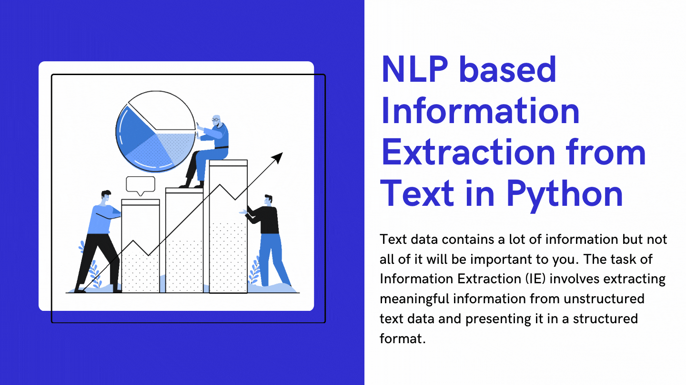

# NLP-based-information-extraction

## How it works?
We all know that sentences are made up of words belonging to different Parts of Speech (POS). There are eight different POS in the English language: noun, pronoun, verb, adjective, adverb, preposition, conjunction, and intersection.

The POS determines how a specific word functions in meaning in a given sentence. For example, take the word “right”. In the sentence, “The boy was awarded chocolate for giving the right answer”, “right” is used as an adjective. Whereas, in the sentence, “You have the right to say whatever you want”, “right” is treated as a noun.

This goes to show that the POS tag of a word carries a lot of significance when it comes to understanding the meaning of a sentence. And we can leverage it to extract meaningful information from our text. I have used spaCy library for that.

## Feel free to explore the code!
